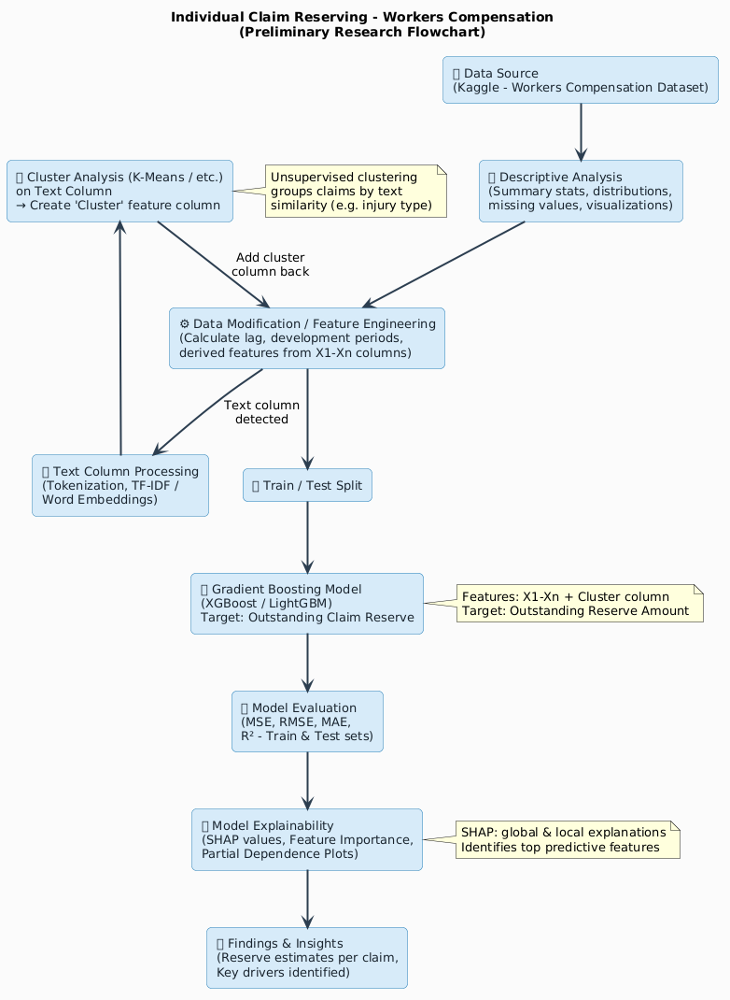

```{=latex}
\setcounter{page}{1}
\pagestyle{plain}
```

# Background
## Claim Reserving in Insurance
Claim reserving is one of the most critical functions in the insurance industry. It refers to the process of estimating the amount of money an insurer must set aside today to meet future claim obligations that have either been reported but not yet fully settled (RBNS), or have been incurred but not yet reported (IBNR). Accurate reserve estimation is essential not only for the financial solvency of insurance companies but also for regulatory compliance, pricing, and strategic planning [1].
Traditionally, actuaries have relied on aggregate triangle-based methods such as the Chain-Ladder method, the Bornhuetter-Ferguson method, and the Cape Cod technique to estimate reserves. These methods group claims into development triangles by accident year and development period, and then project ultimate losses based on historical patterns [2]. While these approaches are well-established and widely accepted by regulators, they operate at an aggregated level and lose a significant amount of information available at the individual claim level. They also assume that historical development patterns will continue into the future, which may not hold in the presence of structural changes, economic shocks, or shifts in claims management behaviour [3].
In recent years, there has been growing interest in individual claim reserving — that is, predicting the outstanding liability for each specific claim rather than an aggregate portfolio. This approach leverages the rich covariate information available at the policy and claimant level, including demographic characteristics, claim descriptions, injury types, and payment history. Individual claim reserving allows for more granular uncertainty quantification, better identification of large or unusual claims, and a more direct connection between underwriting data and reserve estimates [4].
The rise of machine learning has opened new avenues for individual claim reserving. Models such as gradient boosting, neural networks, and random forests have demonstrated strong predictive performance in actuarial applications, often outperforming classical statistical methods in terms of accuracy while also handling non-linear relationships and high-dimensional feature spaces effectively [5]. However, a key challenge in applying machine learning to insurance reserving is interpretability: actuaries and regulators require not just accurate predictions but also explainable outputs that can be justified and audited. This has motivated the growing use of post-hoc explainability tools such as SHAP (SHapley Additive exPlanations) in actuarial machine learning workflows [6]. 

## Workers Compensation Insurance
Workers compensation insurance is a mandatory form of employer liability insurance that provides financial benefits to employees who suffer work-related injuries or illnesses. It covers medical expenses, rehabilitation costs, and lost wages arising from occupational accidents, and in the event of fatality, provides death benefits to dependants. Workers compensation is one of the largest lines of insurance in many jurisdictions, particularly in the United States, Australia, and Canada, where it constitutes a significant portion of the non-life insurance market [7].
The nature of workers compensation claims makes reserving particularly challenging. Claims can remain open for many years — sometimes decades — especially in cases involving permanent disability, ongoing medical treatment, or litigation. The ultimate cost of a claim is therefore highly uncertain at the time of initial reporting, and reserve estimates must be updated continuously as new information emerges. Furthermore, the claim population is heterogeneous: a single portfolio may include everything from minor soft-tissue injuries resolved within weeks to catastrophic spinal injuries that generate lifetime medical management costs [8].
Claims in workers compensation datasets typically include a rich mix of structured data (age, wages, hours worked, occupation) and unstructured text data (free-text descriptions of the accident and injury). This combination presents a unique opportunity: by applying natural language processing (NLP) techniques to the free-text fields, it is possible to extract latent patterns in injury type, accident mechanism, and claim complexity that are not captured by the structured variables alone. Integrating these textual signals into a predictive reserving model has the potential to materially improve reserve accuracy [9]. 

## Research Aim
This project aims to develop an interpretable machine learning model for individual claim reserving on a workers compensation insurance dataset. The study will combine actuarial feature engineering, NLP-based cluster analysis on claim descriptions, and gradient boosting to predict the outstanding reserve (proxied by the Ultimate Incurred Claim Cost) for each individual claim. Model outputs will be explained using SHAP values to ensure transparency and auditability of the predictions.

# Data Souce and Description

The dataset used in this study is sourced from Kaggle, specifically from the Actuarial Loss Estimation competition. It is a secondary, synthetically generated dataset containing 54,000 workers compensation insurance policies, all of which involve an accident event. The dataset is publicly available and designed to replicate the characteristics of real-world workers compensation claims data, making it well-suited for academic research and model development [10].

The dataset (`data.csv`) contains the following fields:

| Field | Type | Description |
| --- | --- | --- |
| ClaimNumber | Identifier | Unique policy/claim identifier |
| DateTimeOfAccident | DateTime | Date and time the accident occurred |
| DateReported | Date | Date the accident was reported to the insurer |
| Age | Numerical | Age of the injured worker |
| Gender | Categorical | Gender of the worker |
| MaritalStatus | Categorical | Marital status: Married (M), Single (S), Unknown (U) |
| DependentChildren | Numerical | Number of dependent children |
| DependentsOther | Numerical | Number of other dependants (excluding children) |
| WeeklyWages | Numerical | Total weekly wage of the worker |
| PartTimeFullTime | Binary | Employment type: Part-time (P) or Full-time (F) |
| HoursWorkedPerWeek | Numerical | Average hours worked per week |
| DaysWorkedPerWeek | Numerical | Number of days worked per week |
| ClaimDescription | Free Text | Narrative description of the accident and injury (key NLP input) |
| InitialIncurredClaimCost | Numerical | Initial reserve estimate set by the insurer at time of reporting |
| UltimateIncurredClaimCost | Numerical | Target: total final claims payments by the insurer (to be predicted) |

The target variable for this study is the `UltimateIncurredClaimCost`, which represents the total amount ultimately paid by the insurer and serves as a proxy for the outstanding reserve when viewed at the point of claim reporting. The `ClaimDescription` field is of particular analytical interest, as it provides unstructured textual information about the nature and mechanism of each injury, which will be processed using NLP techniques as part of the feature engineering pipeline.

# Proposed Analytical Workflow
The overall analytical pipeline for this project is summarised in the flowchart below. The workflow proceeds from data acquisition through descriptive analysis, feature engineering, NLP-based clustering, gradient boosting modelling, evaluation, and finally SHAP-based explainability. The inclusion of the cluster feature — derived from the ClaimDescription text column — represents a key methodological innovation that connects unstructured text data to the predictive modelling stage.

{width=10in height=6in}


# Tools and Technologies
All analyses will be conducted in R, a statustical computing 

All analyses will be conducted in R, a statistical computing environment widely used in actuarial science and insurance research. The following packages and tools will be employed across the different stages of the pipeline: 

- **Data Manipulation and Visualization**: `tidyverse` (including `dplyr`, `ggplot2`, `tidyr`) for data wrangling and exploratory data analysis. 

- **Natural Language Processing**: `tidytext` for text preprocessing and tokenization, `text2vec` for vectorization, and `kmeans` for clustering the claim descriptions. 

- **Machine Learning**: `xgboost` for building the gradient boosting model, chosen for its strong performance in structured data and its ability to handle missing values and non-linear relationships. 

- **Model Explainability**: `SHAPforxgboost` for calculating SHAP values to interpret the contribution of each feature to the model's predictions. 

- **Reproducibility**: `renv` for managing package dependencies and ensuring that the analysis can be reproduced in a consistent computational environment. All code will be version-controlled using Git, and the final analysis will be documented in a Quarto report to facilitate transparency and dissemination of results. 


# References
[1]  England, P. D., & Verrall, R. J. (2002). Stochastic claims reserving in general insurance. British Actuarial Journal, 8(3), 443–518. 

[2]  Mack, T. (1993). Distribution-free calculation of the standard error of chain-ladder reserve estimates. ASTIN Bulletin, 23(2), 213–225. 

[3]  Wüthrich, M. V., & Merz, M. (2008). Stochastic Claims Reserving Methods in Insurance. John Wiley & Sons. 

[4]  Pigeon, M., Antonio, K., & Denuit, M. (2013). Individual loss reserving with the multivariate skew normal framework. ASTIN Bulletin, 43(3), 399–428. 

[5]  Wüthrich, M. V. (2018). Machine learning in individual claims reserving. Scandinavian Actuarial Journal, 2018(6), 465–480. 

[6]  Lundberg, S. M., & Lee, S.-I. (2017). A unified approach to interpreting model predictions. Advances in Neural Information Processing Systems, 30, 4765–4774. 

[7]  Leigh, J. P. (2011). Economic burden of occupational injury and illness in the United States. Milbank Quarterly, 89(4), 728–772. 

[8]  Tossavainen, P. (2006). Workers' compensation: A multinational comparison of systems and costs. International Social Security Review, 59(2), 37–61. 

[9]  Kuo, K. (2019). DeepTriangle: A deep learning approach to loss reserving. Risks, 7(3), 97. 

[10]  Kaggle. (2020). Actuarial Loss Estimation Competition Dataset. Retrieved from https://www.kaggle.com/competitions/actuarial-loss-estimation
